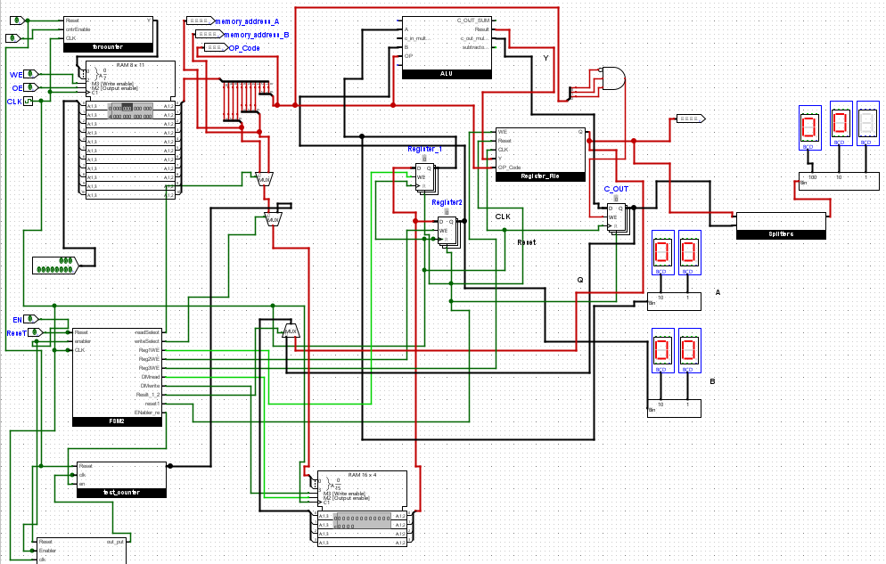

# 4-bit Programmable Microarchitecture using Logisim Evolution

## Project Overview

This project implements a programmable microarchitecture using Logisim Evolution as part of the Digital Logic Design (DLD) course. The project aims to execute six basic operations, including three arithmetic and three logical operations. The components include a Program Counter, Instruction Memory, Data Memory, ALU, Register File, and a Control Unit (FSM and Counters).

## Table of Contents
1. [Abstract](#abstract)
2. [Problem Statement](#problem-statement)
3. [Design Methodology](#design-methodology)
   - [Functional Requirements](#functional-requirements)
   - [Approach](#approach)
4. [Block Diagram](#block-diagram)
5. [Circuit Components](#circuit-components)
   - [Program Counter](#program-counter)
   - [Instruction Memory](#instruction-memory)
   - [Data Memory](#data-memory)
   - [ALU](#alu)
   - [Register File](#register-file)
   - [Control Unit (FSM and Counters)](#control-unit)
6. [Improvements](#improvements)
7. [Conclusion](#conclusion)
8. [Usage](#usage)
9. [Contributors](#contributors)

## Abstract

A programmable microarchitecture capable of performing a variety of operations has been designed and implemented. This project marks the completion of the DLD course and involves performing six basic operations: three arithmetic (Addition, Subtraction, Multiplication) and three logical (Greater than, Equal to, Lesser than). The report details the design of the instruction format and program counters which help in executing the programs sequentially at their desired times.

## Problem Statement

The goal is to implement a functional prototype of a programmable microarchitecture capable of executing six operations: three arithmetic and three logical.

## Design Methodology

### Functional Requirements
1. The programmable microarchitecture is designed to perform the following tasks:
   - Arithmetic Operations:
     - Addition
     - Subtraction
     - Multiplication
   - Logical Operations:
     - Greater than
     - Equal to
     - Lesser than
2. The architecture must contain 8 registers.
3. Instruction and Data memory should be stored separately.

### Approach
- Separate Instruction and Data Memory have been used.
- ALU performs arithmetic and logical operations.
- Register File stores results of the operations.
- FSM and Counters function as the Control Unit for executing instructions.

## Block Diagram

The block diagram represents the entire project. The Program Counter controls the Instruction Memory, determining when the next instruction should be executed. Instructions and data are stored in separate memories. The ALU performs operations and stores results in the Data Memory.

## Circuit Components

### Program Counter
The Program Counter keeps track of the instructions to be executed, using a 24-clock cycle per instruction.

### Instruction Memory
Stores instructions with an 11-bit width, including addresses for inputs and operation codes.

### Data Memory
Stores values of inputs and results of operations. It uses a RAM module with 4-bit data width and 4 address bit width.

### ALU
Performs the specified arithmetic and logical operations based on the instructions.

### Register File
Stores the results from the ALU operations.

### Control Unit (FSM and Counters)
FSM controls the timing and operation of the registers and memory, automating the process of loading and storing data.

## Improvements

Future improvements could include optimizing the storage of results, especially for logical operations which only require 1-bit results. Additionally, the design could be enhanced to differentiate between results of different operations more efficiently.

## Conclusion

The project successfully integrates multiple components into a functional prototype of a programmable computer. It has been an educational experience, providing insights into circuit design, teamwork, and consistency.

## Usage

1. Open the project file `Final_Project.circ` in Logisim Evolution.
2. Load the instruction set as defined in the Instruction Memory.
3. Run the simulation to observe the execution of the operations.

## Contributors

- Manahil Mushtaq, BSCS-2021-03
